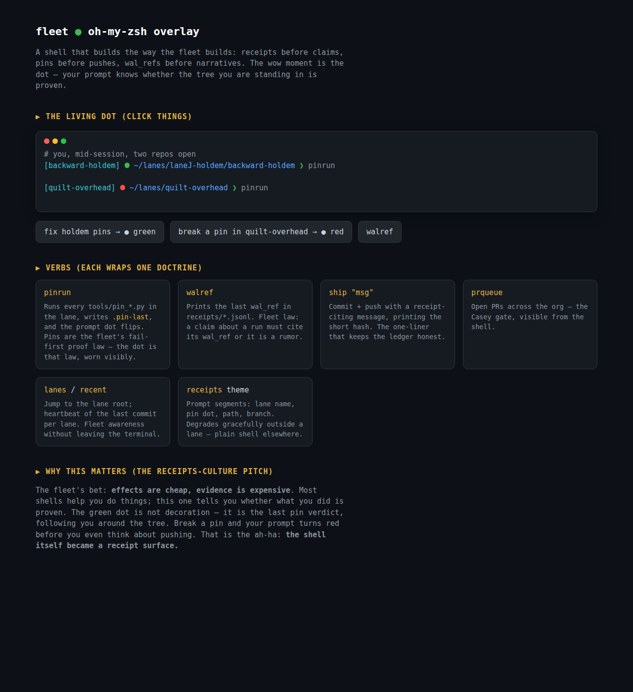

# fleet — an oh-my-zsh overlay for receipts-disciplined building

A builder shell for the Cocapn fleet: wraps fleet doctrine (receipts before
claims, pins before pushes, wal_refs before narratives) into zsh verbs and a
prompt that knows whether the tree you are standing in is proven.

**Upstream oh-my-zsh is never modified** — this overlay only links into
`$ZSH/custom`, oh-my-zsh's designed extension point.



*Open `docs/demo.html` in a browser for the interactive version — break a
pin, watch the dot flip red, `walref` a claim into a fact.*

## Install

```sh
git clone https://github.com/SuperInstance/oh-my-zsh ~/.oh-my-zsh   # if absent
git clone https://github.com/SuperInstance/oh-my-zsh -b jev/main omz-fleet  # or add as remote
zsh fleet/install.sh        # idempotent; links plugin + theme into $ZSH/custom
# then in ~/.zshrc:  plugins=(... fleet)   and   ZSH_THEME="receipts"
```

## Verbs

| verb | doctrine it wraps |
|---|---|
| `pinrun` | runs every `tools/pin_*.py` in the lane, writes `.pin-last`; exit code = any RED. The prompt dot reads this file. |
| `walref` | last `wal_ref` in `receipts/*.jsonl` — a claim without it is a rumor (fleet law, applied here). |
| `ship "msg"` | receipt-cited commit+push, prints short hash. |
| `prqueue` [n] | open PRs across the org (the Casey gate, from the shell). |
| `lanes` / `recent` [n] | jump to lane root / last commit per lane. |

Lane detection walks up-tree for `LEDGER.md` / `receipts/` / `tools/` — the
overlay discovers, it never invents. Outside a lane the prompt degrades to a
plain shell.

## The receipts theme

```
[backward-holdem] ● ~/lanes/laneJ-holdem/backward-holdem ❯        master
```

The `●` is the last `pinrun` verdict (green PASS / red FAIL), cached in
`.pin-last`. The wow: **the shell itself became a receipt surface** — break
a pin and your prompt turns red before you think about pushing.

## Pins

`zsh fleet/test_pins.zsh` — 13 headless pins (fail-first authored): plugin
loads in plain zsh, up-tree lane discovery, pinrun exit codes + `.pin-last`
contract, walref extraction, prompt rendering, installer refusal when omz
absent + idempotent linking. **13/13 green.**

## Boundaries (sealed)

- Prompt/dot reflect the *last local pinrun*, not CI state — freshness is
  your job; the dot is a lamp, not a certificate.
- `.pin-last` is a cache, gitignored by convention; receipts stay in
  `receipts/*.jsonl`.
- `prqueue` needs `gh`; everything else is plain zsh + git + python3.
